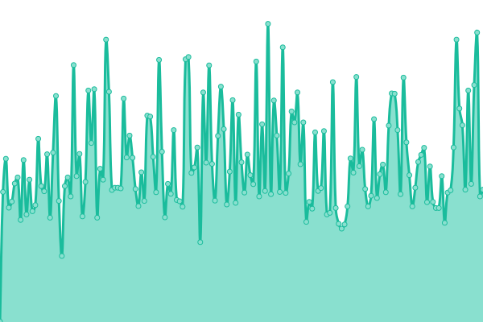
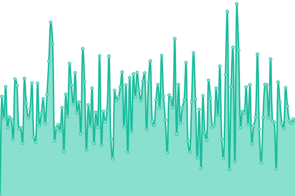
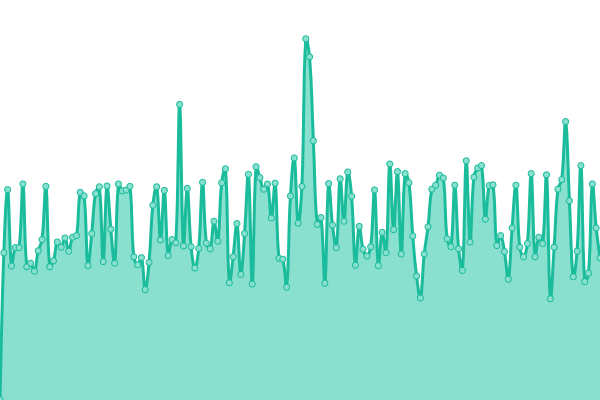

# [📈 Live Status](https://upptime.github.io/upptime): <!--live status--> **🟧 Partial outage**

This repository contains the open-source uptime monitor and status page for [Upptime](https://upptime.js.org), powered by [Upptime](https://github.com/upptime/upptime).

With [Upptime](https://upptime.js.org), you can get your own unlimited and free uptime monitor and status page, powered entirely by a GitHub repository. We use [Issues](https://github.com/upptime/upptime/issues) as incident reports, [Actions](https://github.com/crscodio/crsco-websites-uptime-101/actions) as uptime monitors, and [Pages](https://upptime.github.io/upptime) for the status page.

<!--start: status pages-->
<!-- This summary is generated by Upptime (https://github.com/upptime/upptime) -->
<!-- Do not edit this manually, your changes will be overwritten -->
<!-- prettier-ignore -->
| URL | Status | History | Response Time | Uptime |
| --- | ------ | ------- | ------------- | ------ |
|  [CRESCOTec](https://crescotec.com/) | 🟩 Up | [cresco-tec.yml](https://github.com/crscodio/crsco-websites-uptime-101/commits/HEAD/history/cresco-tec.yml) | 

 253ms
     
 | 

<a href="https://crscodio.github.io/crsco-websites-uptime-101/history/cresco-tec">100.00%</a>
    

|  CRSCO_S1 | 🟥 Down | [crsco-s1.yml](https://github.com/crscodio/crsco-websites-uptime-101/commits/HEAD/history/crsco-s1.yml) | 

 295ms
     
 | 

<a href="https://crscodio.github.io/crsco-websites-uptime-101/history/crsco-s1">0.00%</a>
    

|  CRSCO_S2 | 🟩 Up | [crsco-s2.yml](https://github.com/crscodio/crsco-websites-uptime-101/commits/HEAD/history/crsco-s2.yml) | 

 561ms
     
 | 

<a href="https://crscodio.github.io/crsco-websites-uptime-101/history/crsco-s2">100.00%</a>
    

<!--end: status pages-->

[**Visit our status website →**](https://upptime.github.io/upptime)

## 📄 License

- Powered by: [Upptime](https://github.com/upptime/upptime)
- Code: [MIT](./LICENSE) © [Upptime](https://upptime.js.org)
- Data in the `./history` directory: [Open Database License](https://opendatacommons.org/licenses/odbl/1-0/)
